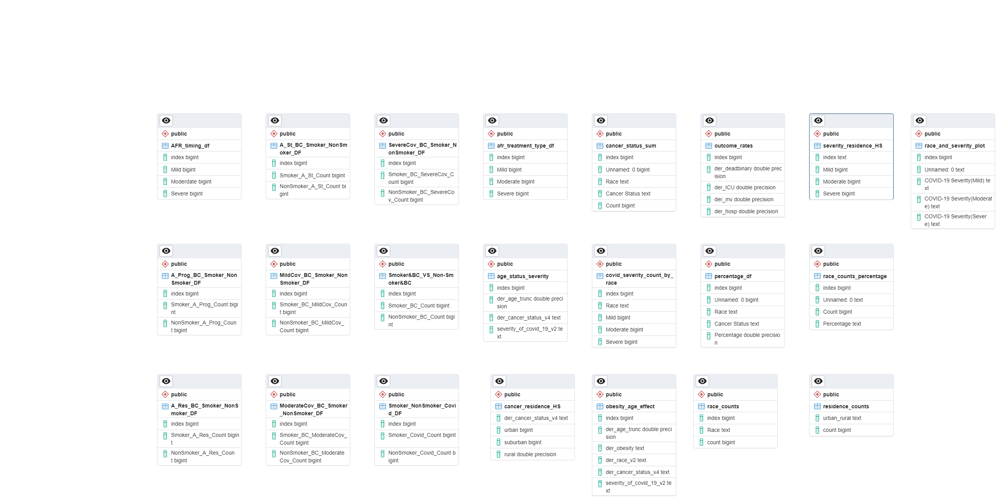

# Breast Cancer Research Group

## Description of Project
Project 3 represents the culmination of our efforts in exploring and visualizing Breast Cancer data, a continuation from the analysis started in Project 1. Our study utilizes a critical dataset from the COVID-19 and Cancer Consortium (CCC19), which focuses on breast cancer patients and examines the outcomes of racial disparities within the context of COVID-19. This dataset includes demographic information and COVID-19 outcomes for patients affected by Breast Cancer, offering a comprehensive view of their experiences and challenges.

Our web-based platform serves as the culmination of this project, synthesizing advanced data engineering and dynamic visualization techniques to present our findings. With the integration of PostgreSQL for database management, Flask for creating API endpoints, and front-end technologies like HTML, CSS, and JavaScript, we've developed a user-centric web application. This platform invites visitors to interact with our data through intuitive visualizations and API endpoints, enabling them to uncover the nuanced relationship between Breast Cancer and COVID-19 outcomes.

Click here for more information about [Project 1](https://github.com/HSaleem352/Bootcamp-Project1)

## Questions We Are Asking of the Data:
### What are the sociodemographic and clinical factors that influence adverse outcomes: 
1. How does the timing and type of their breast cancer treatment affect their COVID-19 outcomes? - Alex
2. Is smoking a factor in severe COVID-19 for individuals with Breast Cancer? - Mina
3. Amongst all the races with different BC statuses, is smoking a factor for them to have COVID-19? - Mina
4. How does race/ethnicity affect COVID with Breast Cancer? - Shan
5. Does obesity and age have an effect on COVID-19 with Breast Cancer? - Fozia
6. Are the severity of COVID-19 and the cancer status affected if the individuals live in urban, suburban, or rural areas? - Hamza
7. What is the isolated effect of age on the risk of COVID-19 and Breast Cancer outcomes? - Dean

## Members of the Group
- Hamza Saleem - @HSaleem352
- Mina Bagheri - @minalbm
- Dean Ninalga - @Ninalgad 
- Fozia - @FoziaY
- Shan Lian - @Lians03
- Alejandra - @AlejandraFeatherston

## Work Breakdown
- Finding the database: All group members
- SQL and data reading: Hamza
- Flask: All group members
- Plot creation: All group members
- Home page: Mina and Hamza
- Fly.io deploy: Shan
- Our Team, Limitations & References pages: Mina
- Question 1 related page: Alejandra
- Question 2 related page: Mina
- Question 3 related page: Mina
- Question 4 related page: Shan
- Question 5 related page: Fozia
- Question 6 related page: Hamza
- Question 7 related page: Dean

## Instructions on How to Use and Interact with the Project
### Method 1: Accessing the Web Application Directly
Visit our hosted web application by navigating to https://breastcancerproject3.fly.dev/

### Method 2: Running the Code Locally
- Open app.py and run the application.
- Open the local host server: http://127.0.0.1:5000
- Use the navigation bar to move through the webapp
- Scroll down to view the page contents
- Use the buttons in the home page to access the question pages
- Use the navigation bar to return to homepage
- Follow directions on the pages to interact with elements


## Efforts for Ethical Considerations Made in the Project
The dataset that we are using is associated with a Creative Commons Attribution 4.0 International License. This allows for the re-distribution and re-use of the dataset as long as the creators are porperly cited. We made sure to cite the creators of the dataset both in this ReadMe and on the Website - thus adhering to the Data License.

Our website doesn't collect any user information like name or contact information, thus we did not have to deploy additional security measures to ensure we were safely storing and using the information.

We made sure to make the website easy to use and interpret, and engaging so that it is accessible to the general public. In this way, we are also making scientific research more accessible to the lay audience.

## Dataset:
[Nagaraj, G., Khaki, A., & Shah, D. (2023). Covid-19 and Cancer Consortium (CCC19) breast cancer and racial disparities outcomes study. Zenodo](https://doi.org/10.5281/zenodo.7644334). 

The same dataset was used from project 1. The data was extracted from a csv file from the source mentioned above and then transformed to give the desired tables 
representing each question. The extraction and transforming was performed in project 1 however, in the write_SQL file, some examples can be seen for the transformation part. 
Since the data was cleaned and tranformed into structured dataframes, SQL was used to save each dataframe in the form of a table. In order to let this wepapp be hosted from
any host device, the SQL Server and the Database were created on Render. Using pgAdmin and Postgres, we were able to upload all our dataframes into render's database and were 
able to successfully read from the database. SQL Alchemy and pandas library were used to communicate between our flaskapp and the SQL server. Since each dataframe represents a different question, they are all independant of each other and share no connection to one another. The ERD of the Database is showing below:  


## Code Snippets
**Mina**

Home page question cards animation:
```python
.card-link .card {
    transition: transform 0.3s ease-in-out;
    width: 100%; /* Set a fixed width for the card */
}

.card-link:hover .card {
    transform: scale(1.08); /* Increase the size on hover, adjust as needed */
    transition: 0.7s;
    box-shadow: 0px 0px 2px 2px darkgrey;     
}
```
Removing the blue color hyperlink:
```python
.icon-link:hover {
    color: inherit;
}
```
Flip cards:
```python
    <script>
        function flipCard(card) {
            card.classList.toggle('flipped');
        }
    </script>
//css//
.card.flipped {
    transform: rotateY(180deg);
}
```
Card click expand:
```python
    <script>
        document.querySelectorAll('.card').forEach(function(card) {
            card.addEventListener('click', function() {
                var targetCollapse = card.getAttribute('data-target');
                var isExpanded = $(targetCollapse).hasClass('show');
    
                // If the explanation is not expanded, expand it
                if (!isExpanded) {
                    $(targetCollapse).collapse('show');
                }
            });
        });
    </script>
```


**Alejandra**

html code for the carousel displaying the pie charts with the timing of BC treatment for each covid outcome 
  <!-- Timing Carousel -->
  
  <!-- Slideshow container -->
  <div class="timing-slideshow-container">
  
    <!-- Bar Charts with caption text -->
    <div class="myTimingSlides">
      <div id="afr_mild_timing_pie" style ="width:100%"></div>
      <div class="timingtext" style = "width:100%"> The most number of patients experienced mild covid outcomes when they had ATC within the first 4 weeks of developing covid</div>
    </div>
  
    <div class="myTimingSlides">
      <div id="afr_moderate_timing_pie" style ="width:100%"></div>
      <div class="timingtext" style = "width:100%"> The most number of patients experienced moderate covid outcomes when they had ATC within the first 4 weeks of developing covid</div>
    </div>
  
    <div class="myTimingSlides">
      <div id="afr_severe_timing_pie" style ="width:100%"></div>
      <div class="timingtext" style = "width:100%"> The most number of patients experienced severe covid outcomes when they had ATC 3 months after of developing covid</div>
    </div>
  
    <!-- Next and previous buttons -->
    <a class="prev" onclick="plusSlides(-1)">&#10094;</a>
    <a class="next" onclick="plusSlides(1)">&#10095;</a>
  
  </div>
  
  <br>
  
  <!-- The dots/circles -->
  <div style="text-align:center">
    <span class="dot" onclick="currentSlide(1)"></span> 
    <span class="dot" onclick="currentSlide(2)"></span> 
    <span class="dot" onclick="currentSlide(3)"></span> 
  </div>

css code for the carousel displaying the pie charts with the timing of BC treatment for each covid outcome 
```python
* {box-sizing:border-box}

/* Slideshow container */
.timing-slideshow-container {
  max-width: 700px;
  height: 600px;
  position: relative;
  margin:auto;
  overflow: hidden;
}

/* Hide the images by default */
.myTimingSlides {
  display: flex;
  flex-direction: column;
  align-items: center;
  justify-content: center;
  text-align: center;
  width: 100%;
}

/* Next & previous buttons */
.prev, .next {
  cursor: pointer;
  position: absolute;
  top: 50%;
  width: auto;
  margin-top: -22px;
  padding: 16px;
  color: black;
  font-weight: bold;
  font-size: 18px;
  transition: 0.6s ease;
  border-radius: 0 3px 3px 0;
  user-select: none;
  transform: rgba(214, 206, 206, 0.8);
}

/* Position the "next button" to the right */
.next {
  right: 0;
  border-radius: 3px 0 0 3px;
}

/* On hover, add a black background color with a little bit see-through */
.prev:hover, .next:hover {
  background-color: rgba(0,0,0,0.8);
  color: white;
}

/* Caption text */
.timingtext {
  color: black;
  font-size: 15px;
  padding: 8px 12px;
}

/* The dots/bullets/indicators */
.dot {
  cursor: pointer;
  height: 15px;
  width: 15px;
  margin: 0 2px;
  background-color: #bbb;
  border-radius: 50%;
  display: inline-block;
  transition: background-color 0.6s ease;
}

.active, .dot:hover {
  background-color: #717171;
}
```

**Hamza**

amCharts library was used for donut graphs,
plotli was used for bar graph,
animate.css library was used for the home page animation,
bootstrap library was used for collapse buttons.

### SQL Postgres from Render:

for writing data to the server:
```python
with engine.connect() as connection:
    residence_counts.to_sql('api_endpoint',connection)
```
for reading data from the server:
```python
with engine.connect() as connection:
        df = pd.read_sql('api_endpoint',connection)
```

### Gradient Donut Graph:
```python
// Read the Data
  var names = response.map(d => d.urban_rural);
  var count = response.map(d => d.count);
  var figure = [];

  for (let i = 0; i < names.length; i++) {
    figure.push(
    {labels: names[i], values: count[i]}
    )
  }

  //Create root element
  var root = am5.Root.new("residence_pie");

  // Set themes
  root.setThemes([
    am5themes_Animated.new(root),
  ]);

  // Create chart
  var chart = root.container.children.push(am5percent.PieChart.new(root, {
    radius: am5.percent(90),
    innerRadius: am5.percent(50),
    layout: root.horizontalLayout
  }));
  // Creating the series template
  var series = chart.series.push(am5percent.PieSeries.new(root, {
    name: "Residence",
    valueField: "values",
    categoryField: "labels"
  }));
  // Setting the data
  series.data.setAll(figure)

  // Disabling labels and ticks
  series.labels.template.set("visible", false);
  series.ticks.template.set("visible", false);

  // Adding gradients
  series.slices.template.set("strokeOpacity", 0);
  series.slices.template.set("fillGradient", am5.RadialGradient.new(root, {
    stops: [{
      brighten: -0.8
    }, {
      brighten: -0.8
    }, {
      brighten: -0.5
    }, {
      brighten: 0
    }, {
      brighten: -0.5
    }]
  }));

  // Create legend
  var legend = chart.children.push(am5.Legend.new(root, {
    centerY: am5.percent(50),
    y: am5.percent(50),
    layout: root.verticalLayout
  }));
  // set value labels align to right
  legend.valueLabels.template.setAll({ textAlign: "right" })
  // set width and max width of labels
  legend.labels.template.setAll({ 
    maxWidth: 140,
    width: 140,
    oversizedBehavior: "wrap"
  });

  legend.data.setAll(series.dataItems);


  // Play initial series animation
  series.appear(1000, 100);
  
**Dean** \
Functions to compute densities
```python
// Function to compute density
function kernelDensityEstimator(kernel, X) {
    return function(V) {
        return X.map(function(x) {
            return [x, d3.mean(V, function(v) {
                return kernel(x - v);
            })];
        });
    };
}

function kernelEpanechnikov(k) {
    return function(v) {
        return Math.abs(v /= k) <= 1 ? 0.75 * (1 - v * v) / k : 0;
    };
}

function plotCancerDensity() {
    d3.json("/api/v1/age_status_severity").then(function(data) {
        let traces = []
        let density = null,
            dat = null

        for (i in canHueOrder) {
            dat = data
                .filter((d) => d.der_cancer_status_v4 === canHueOrder[i])
                .map((d) => d.der_age_trunc)
            density = kde(dat)
            traces.push({
                x: density.map((d) => d[0]),
                y: density.map((d) => 100 * (dat.length / data.length) * d[1]),
                line: {
                    color: canColors[i]
                },
                mode: "lines",
                name: canNames[i],
                type: "scatter",
                hovermode: false
            })
        }

        Plotly.newPlot('density-cancer', traces);
    })
}
```
Custom hover template for stacked densities
```python
            hovertemplate = 'Relative:%{customdata:.3f})%<extra>%{fullData.name}</extra>'
            if (i == (covHueOrder.length - 1)) {
                hovertemplate = 'Overall Density:%{y:.3f}% | Relative:%{customdata:.3f})%<extra>%{fullData.name}</extra>'
            }
            max_ = Math.max(max_, Math.max(...y))
            traces.push({
                x: x,
                y: y,
                line: {
                    color: covColors[i],
                },
                fill: "tonexty",
                fillcolor: covColors[i],
                mode: "lines",
                name: covNames[i],
                type: "scatter",
                customdata: subvector(y, y_last),
                hovertemplate: hovertemplate,
                hoverlabel: {
                    font: {
                        color: 'white',
                        size: 18
                    }
                }
            })
```

**Dean** \
Functions to compute densities
```python
// Function to compute density
function kernelDensityEstimator(kernel, X) {
    return function(V) {
        return X.map(function(x) {
            return [x, d3.mean(V, function(v) {
                return kernel(x - v);
            })];
        });
    };
}

function kernelEpanechnikov(k) {
    return function(v) {
        return Math.abs(v /= k) <= 1 ? 0.75 * (1 - v * v) / k : 0;
    };
}

function plotCancerDensity() {
    d3.json("/api/v1/age_status_severity").then(function(data) {
        let traces = []
        let density = null,
            dat = null

        for (i in canHueOrder) {
            dat = data
                .filter((d) => d.der_cancer_status_v4 === canHueOrder[i])
                .map((d) => d.der_age_trunc)
            density = kde(dat)
            traces.push({
                x: density.map((d) => d[0]),
                y: density.map((d) => 100 * (dat.length / data.length) * d[1]),
                line: {
                    color: canColors[i]
                },
                mode: "lines",
                name: canNames[i],
                type: "scatter",
                hovermode: false
            })
        }

        Plotly.newPlot('density-cancer', traces);
    })
}
```
Custom hover template for stacked densities
```python
            hovertemplate = 'Relative:%{customdata:.3f})%<extra>%{fullData.name}</extra>'
            if (i == (covHueOrder.length - 1)) {
                hovertemplate = 'Overall Density:%{y:.3f}% | Relative:%{customdata:.3f})%<extra>%{fullData.name}</extra>'
            }
            max_ = Math.max(max_, Math.max(...y))
            traces.push({
                x: x,
                y: y,
                line: {
                    color: covColors[i],
                },
                fill: "tonexty",
                fillcolor: covColors[i],
                mode: "lines",
                name: covNames[i],
                type: "scatter",
                customdata: subvector(y, y_last),
                hovertemplate: hovertemplate,
                hoverlabel: {
                    font: {
                        color: 'white',
                        size: 18
                    }
                }
            })
```

**Shan** \
Generates pie charts for each race category with dynamic labeling
```python
    const raceToChartIdMap = {
    'Hispanic': '1',
    'Non-Hispanic AAPI': '2',
    'Non-Hispanic Black': '3',
    'Non-Hispanic White': '4',
    'Other': '5'
};

let url3 = '/api/v1/cancer_status_sum'
d3.json(url3).then(function(data) {
    let groupedData = d3.group(data, d => d.Race);

    groupedData.forEach(function(values, race) {
        let labels = values.map(d => d['Cancer Status']);
        let counts = values.map(d => d.Count);
        let chartIdSuffix = raceToChartIdMap[race]; 
        if (!chartIdSuffix) {
            console.error('Unknown race category:', race);
            return; 
        }

        let trace = {
            labels: labels,
            values: counts,
            type: 'pie',
            textinfo: "percent",
            insidetextorientation: "auto"
        };

        let layout = {
            paper_bgcolor: 'white',
            plot_bgcolor: 'white',
            legend: {
                font: {
                    size: 16 // Adjust this value as needed to increase the font size
                }
            }
        };
             
        let chartId = `graph${chartIdSuffix}`;

        // pie chart create
        Plotly.newPlot(chartId, [trace], layout);
    });
});
```
HTML code for flip-card with a bar chart visualizing ethnic distribution and COVID-19 severity on one side and a static image on the reverse

```python
<div class="name">
  <h1>Relationship Between Ethnic Distribution and COVID-19 Severity</h1>  
</div>

    <!-- Ethnic Distribution and COVID-19 Severity Bar chart  -->
    <div class="container-fluid mt-3">
      <div class="row">
          <div class="col-md-8 p-3 text-black-on-light">
              <div class="flip-card">
                  <div class="flip-card-inner">
                      <div class="flip-card-front">
                          <div id="covid-severity-bar-chart" style="max-width: 100%;"></div>
                      </div>
                      <div class="flip-card-back">
                          
                      </div>
                  </div>
              </div>
          </div>
          <div class="col-md-4 p-3 text-black-on-light">
              <h2>Analysis</h2>
              <h2>Conclusions</h2>
          </div>
      </div>
  </div>

```
## References

**Hamza**
* [Creating postgresql engine](https://stackoverflow.com/questions/62688256/sqlalchemy-exc-nosuchmoduleerror-cant-load-plugin-sqlalchemy-dialectspostgre)
* [Listing all tables in postgres using SQLAlchemy](https://www.pythonsheets.com/notes/python-sqlalchemy.html)  
* [Visual for amcharts](https://www.amcharts.com/demos/donut-with-radial-gradient/)
* [Pic for home page](https://healthcare.utah.edu/huntsmancancerinstitute/sites/g/files/zrelqx336/files/styles/freeform_phone/public/migrate_images/mammo-mask.jpg?h=bdbe9ddb&itok=VPDk9U4v)
* [Animations](https://animate.style/)

**Alejandra**
* [Information on the license applied to the dataset](https://creativecommons.org/licenses/by/4.0/legalcode)
* [Information on ethical web design](https://capacityinteractive.com/blog/the-principles-of-ethical-web-design/)
* [Creating the carousel](https://www.w3schools.com/howto/howto_js_slideshow.asp)
* [Creating the flip cards](https://www.w3schools.com/howto/howto_css_flip_card.asp)
* [Aranging text vertically](https://www.shecodes.io/athena/38295-how-to-make-h1-on-two-lines-with-different-colors)
* [Text alignment in css](https://www.w3schools.com/css/css_text_align.asp)


**Mina**
* [Page structures](https://getbootstrap.com) , ChatGPT
* [Uploading images from GoogleDrive to Our Team page](https://stackoverflow.com/questions/77851898/using-google-drive-link-as-img-src-on-react-app-not-working)
* [Home page navbar](https://tachyons.io/components/nav/logo-titles-links-centered/index.html)

**Shan**
* [Creating the carousel](https://www.w3schools.com/howto/howto_js_slideshow.asp)
* [Deploy a Fly.io App](https://fly.io/docs/apps/deploy/)
* [First image for race/covid/breastcancer page](https://www.cbcn.ca/web/default/files/public/Stories/race%20influence%20header.jpeg)
* [Second image for race/covid/breastcancer page](https://dpjh8al9zd3a4.cloudfront.net/image/h:720,w:1800/183865)


**Dean**
* [Density plot with several groups in d3.js](https://d3-graph-gallery.com/graph/density_double.html)
* [Animations in JavaScript](https://plotly.com/javascript/animations/)
* [Dot Plots in JavaScript](https://plotly.com/javascript/animations/)


